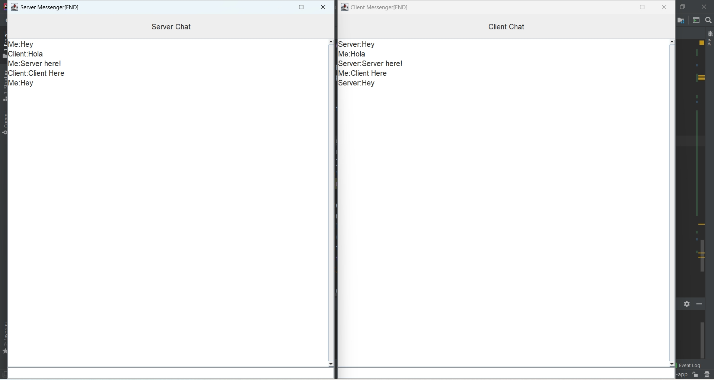
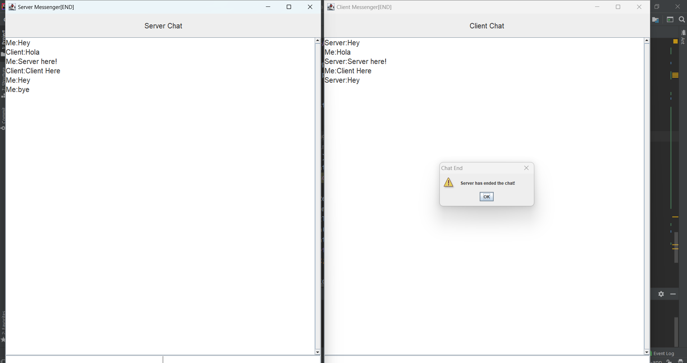

<h1 align="center">Chat Application using Java 🚀</h1>
<h4 align="center"> This is a GUI based chat application build using Java where client and server can chat with each other.</h4>

 

## Tech Stack :

Above chat application is built using the following technologies:

- **Java Swing** - a GUI toolkit in Java that provides a rich set of components for building graphical user interfaces.
- **Java** - platform-independent programming language used for developing client and server

 

## Screenshots :

  - <h4> Chat App window of client and server</h4>

  

 

- <h4> Screenshot of Server chat ended pop-up (if server has ended that chat)</h4>

  

 

### Local development
You can set this up locally with the following steps:

1. Navitage to `src/com/chatapp` folder and compile the *Server.java* and *Client.java* classes using `javac` cmd.
1. Run the Server.java first and then Client.java.

PS : Server will stay in waiting state unless you start client.

 

<h3> I have also written a blog on the same. Please checkout that as well -> </h3> [Blog Link](https://ruchirstechblogs.hashnode.dev/build-chat-application-using-java)
